Install dependencies
```
  yarn install
```
Build App
```
  yarn build
```
Run App
```
  yarn start
```

Debug App
```
  yarn debug
```

# Getting Started with Integrating Okay to your server

 To proceed with Okay integration, you are required to create an account using this [link](https://okaythis.com/signup). Once you are successfully signed up, login in with the credentials that you used to create the account [here](https://demostand.okaythis.com/multi-tenant-admin/login).

 Once you are logged in to your [dashboard](https://demostand.okaythis.com/pss-admin/dashboard) click on **Tenants** in the top toolbar, then select [**tenants**](https://demostand.okaythis.com/multi-tenant-admin/tenants) from the drop down menu.

 

 The [**Tenants**](https://demostand.okaythis.com/multi-tenant-admin/tenants) web page is where you will register your server as a SPS that will communicate with Okay servers in order to verify/intiate secure transactions/authentications. Your tenant page should present a table that looks like the table below.

 

## Overview of the Tenant table

 As you can see, you already have an entry in the **Tenants** table. The contents of that row are essential in understanding how to integrate Okay into your server.

### Tenant ID

 The first column under the table is what we refer to as your **Tenant ID**. In the image above my **Tenant Id** is `40007`. It is very important that you take note of this value as we will be using this value for our transactions/authentication.

### Name

 The text under the **Name** column in the **Tenants** table is the name of the company you provided at the time of your sign up. 

### Status

 Specifies the status of your tenant.

### Trial Expiration

 Shows your tenant trial expiration date, if you are still on trial mode.

### Actions


The **Action** column has three buttons that allows us to manage our tenant credentials.

## Adding Credentials to your Tenant

To make our tenant useful we will be adding more information to the tenant to connect properly/securely to Okay servers. Click on the pencil icon under **Actions** to complete the tenant registration.


To be able to recieve feedbacks from Okay servers you will need to add a valid callback url (A callback url is an endpoint on your server that will be used as a point of communication by **Okay** to notify your server about the status of transactions/authentication) to the **Callback** input field. We will also need to generate a secret secure token(or secret) that will be used to verify all transactions by **Okay** secure servers. The token could be any aphanumeric secure string that contains between 0-30 characters and must be kept secret.

**Note:** we will be referring to our **Token** as **secret** in further illustrations.

**LINKING USERS**
===============

Before we can authorize transactions using **Okay**, we need to link our users to **Okay** so that we can identify all transactions coming from different users.

### Provide a Unique Value Generator

Before we proceed to linking your users to **Okay**. We need to generate and store a **Unique Identifier** for every end-user in order to differentiate all your users. You can use any alpha-numeric character to compose this value, for example a **UUID**. We will be using this value in all our requests as **User Unique Identifier**. This normally serves as value to the **"userExternalId"** key in our payload.

### ***This is a typical structure of our JSON payload for linking users***

```JSON
  {
    "tenantId": "<your tenant id>",
    "userExternalId": "User Unique Identifier",
    "signature": "BASE64[SHA256(tenantId | userExternalId | secret)]"
  }
```

The `tenantId` key in our payload above, is the **ID** we got from our ***Tenants*** table. Please refer to **Integrating Okay to your Server** section of this document if you don't already have your tenant id.

The `userExternalId` key in our palyload above is the **User Unique Identifier** you created for your users in order to differentiate them as described in the **Provide a Unique Value Generator** section of this documentation above.

The `signature` key in our payload above is a hash that is generated from concatenating your `tenantId` + `userExternalId` + `secret` (also know as the **Token** you added to your tenant) then passing the concatenated string as value to `SHA256()` algorithm. Then we encode whatever value or string we get from the `SHA256()` algorithm in `BASE64`.

```js
  const crypto = require('crypto')
  const axios = require('axios')

  const PSS_BASE_URL = 'https://demostand.okaythis.com';
  const tenantId = 40007; // replace with your tenantId
  const userExternalId  = 'uid406jkt'; // replace with your unique user id
  const secret = 'securetoken'; // replace with your secret

  const hashStr = `${tenantId}${userExternalId}${secret}`;
  const signature = createHashSignature(hashStr);
  console.log(signature) // returns zqVmg24iAeAqhKdyFOClJdmaB1NBE4lm4K/xnZUwg7M=

  function createHashSignature(hashStr) {
    return crypto
      .createHash('sha256')
      .update(hashStr)
      .digest('base64')
  }
  ...
```

If all is set, we proceed to linking our user. To link a user we need to send our JSON payload as a **POST** request to this endpoint `https://demostand.okaythis.com/gateway/link`.

```js
  const crypto = require('crypto')
  const axios = require('axios')

  const PSS_BASE_URL = 'https://demostand.okaythis.com';
  const tenantId = 40007; // replace with your tenantId
  const userExternalId  = 'uid406jkt'; // replace with your unique user id
  const secret = 'securetoken'; // replace with your secret

  const hashStr = `${tenantId}${userExternalId}${secret}`;
  const signature = createHashSignature(hashStr);


  axios({
    method: 'post',
    headers: {
      'Content-Type': 'application/json'
    },
    url: `${PSS_BASE_URL}/gateway/link`,
    data: {
      tenantId,
      userExternalId,
      signature
    }
  })
  .then((response) => {
    console.log(response.data);
  })
  .catch((error) => {
    console.log(error.response.data)
  });


  function createHashSignature(hashStr) {
    return crypto
      .createHash('sha256')
      .update(hashStr)
      .digest('base64')
  }
```

When your request is correct you'll get a response with the following body:

```JSON
  {
    "linkingCode": "unique short-living code", "eg 416966"
    "linkingQrImg": "base64-encoded image of QR code",
    "status": {
        "code": 0,
        "message": "OK"
    },
  }

  Sample Response:

  {
    "linkingCode": "980565",
    "linkingQrImg":
      "iVBORw0KGgoAAAANSUhEUgAAASwAAAEsAQAAAABRBrPYAAABhUlEQVR42u3aQXKDMAwFUGVYsOQIHIWjhaPlKBwhSy8yqLIkm9CUNMae6XTme0XMW8WqLCkl/mTdCQwMDAzsb1ggW0PomIkm2e5W3+vAqpk+8zLwg+xYgjDeXoHVsfidT8JY3s5+Cjz7uYA1Y7KE2SmAtWaPC9OVFyKwlizlkF2QH6casCK23YDKliH8clGCFbC89O31Nt7t7VGZB1bEAl3YcwgpY4321yAHO8UsRcsn8ZKZRw37mKK/lcdgZ5itm+WQHORixh/+FsCKWYxtmnKuHjXs4524PwWwU0w35eKjPtZvwtIpEPUMVs/Iyrb+Odr9AayeWdOhzZ0FudVvqdIAq2J+A3r9Jtu9VxpgTVicSOROWY4j5+pdeQx2iu27j9zTzWkWBFbFcu8cmw4NcvIm+uUGBDvBtqm7VRoW7TYCAqtnPrdM02BfyYO1YpyajtXbELB2TH+Ss9SxHk4wwIrZU11hD7G5ixO2AFbPdlP32NOxNdHvhvNgnzL8Xw0YGBjYP2ZfZfRH9E/qf44AAAAASUVORK5CYII=",
    "status": {
        "code": 0,
        "message": "OK"
      }
    }
```

For better reference to all possible status code and messages you can recieve from **Okay** server please refer to this [link](https://github.com/Okaythis/okay-example/wiki/Server-Response-Status-Codes).

**LINKING WITH OKAY MOBILE APP**
============================
In other to test if your server is working properly, we strongly recommend you to download the **Okay** mobile app from Google Play Store for [Android](https://play.google.com/store/apps/details?id=com.protectoria.okaythis), or Apple App Store for [iOS](https://apps.apple.com/us/app/okay-this/id1445714228).

## STEPS TO LINKING ON MOBILE APP
After installation proceed to granting the permissions

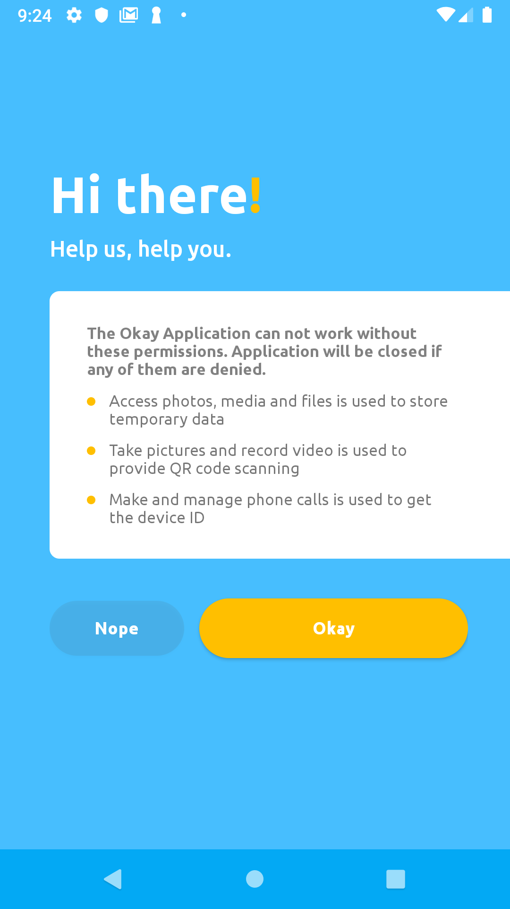


Click the check box on this screen to grant permision then press the back button twice to return the app.

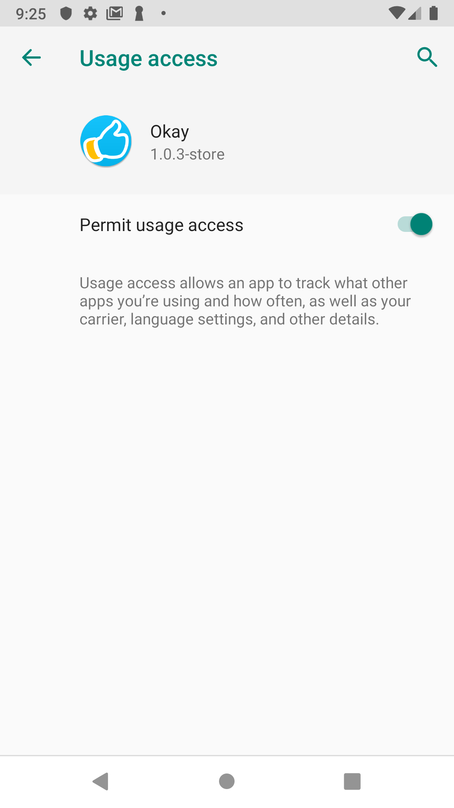

Grant all permissions

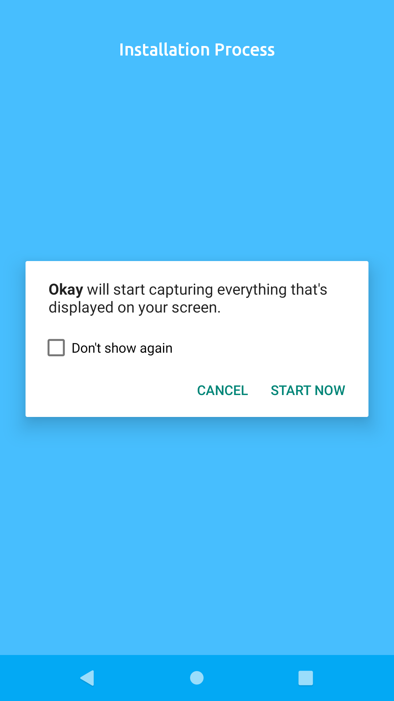

To proceed with linking, click the white button on this screen below.

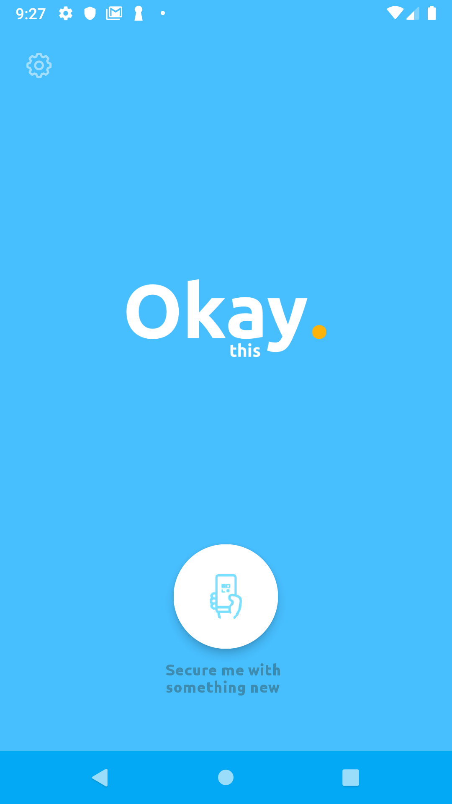

You will be redirected to a camera screen, click the button at the bottom of the camera screen labeled `Type 'em instead` to proceed to the linking screen shown below.

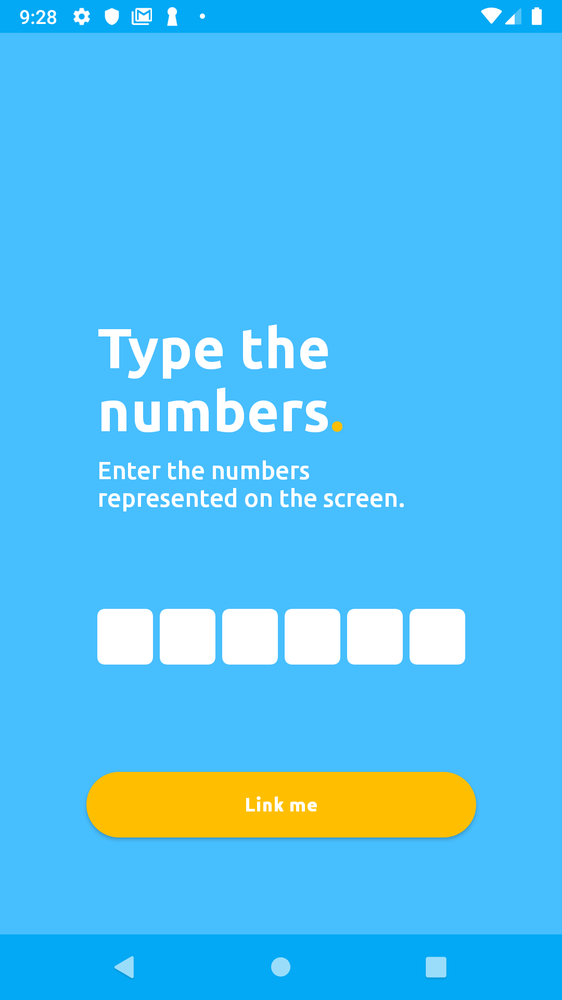

Enter the six digits `linkingCode` you recieved from your linking response into the mobile app's input field, then click `Link me` on the app. In our case the `linkingCode` was `980565`.

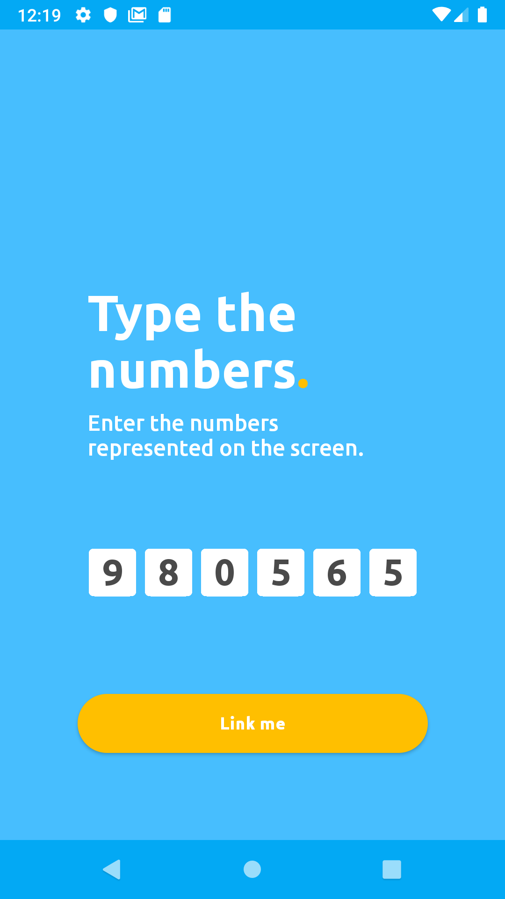

If all goes smoothly, you will see a screen like the one below.

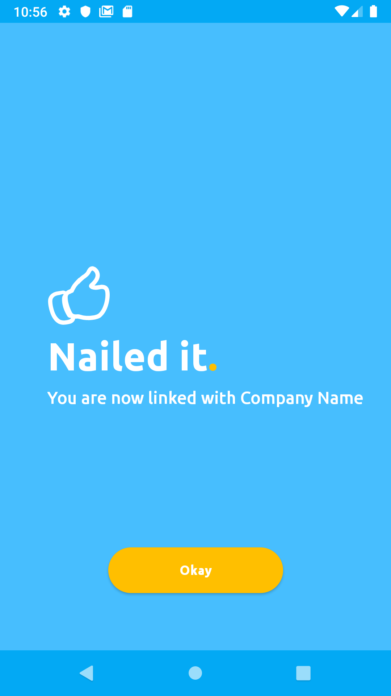

**Authenticate User/Authorize User Action**
==========================================

After Linking a user, we can now authenticate that user or authorize the user's action.

Just like linking a user, we will be sending a JSON payload as a **POST** request to **Okay** using this link `https://demostand.okaythis.com/gateway/auth`.

### ***This is a typical structure of our JSON payload for authenticating users/authorizing user actions***

```JSON
  {
    "tenantId": "<your tenant id>",
    "userExternalId": "User Unique Identifier",
    "type": "<Authorization type>",
    "authParams": {
        "guiText": "message that is shown in the Okay application",
        "guiHeader": "header of the message that is shown in the Okay application"
    },
    "signature": "BASE64[SHA256(tenantId | userExternalId | guiHeader | guiText | type | secret)]"
  }
```

For this request, we will be adding two new fields, the `type` and `authParams` fields.

The `type` key in our JSON payload is a field that allows us to clearly specify the kind of authorization/authentication we choose to initiate. The `type` key can take as value any of these authentication types listed below.

AUTH TYPE | AUTH CODE|
----------|----------|
AUTH_OK | 101 |
AUTH_PIN | 102 |
AUTH_PIN_TAN | 103 |
BIOMETRIC_OK | 105 |
GET_PAYMENT_CARD | 111 |


The `authParams` just contains a **_message_** (`guiText`) and the **_message header_** (`guiHeader`) that will be displayed on the Okay App. The **message** is intended for the user to read, in order to grant Okay the required permission to complete a transaction/authentication.

We can now proceed to sending our request to `Okay` like so.

```js
  const crypto = require('crypto')
  const axios = require('axios')

  const PSS_BASE_URL = 'https://demostand.okaythis.com';
  const tenantId = 40007; // replace with your tenantId
  const userExternalId  = 'uid406jkt'; // replace with your unique user id
  const secret = 'securetoken'; // replace with your secret
  const authParams = {
    guiText: 'Do you okay this transaction',
    guiHeader: 'Authorization requested'
  };
  const AUTH_TYPES = {
    OK: 101,
    PIN: 102,
    PIN_TAN: 103,
    BIOMETRIC_OK: 105,
    GET_PAYMENT_CARD: 111,
}
  const type = AUTH_TYPES.OK

  const hashStr = `${tenantId}${userExternalId}${authParams.guiHeader}${authParams.guiText}${type}${secret}`;
  const signature = createHashSignature(hashStr);


  axios({
    method: 'post',
    headers: {
      'Content-Type': 'application/json'
    },
    url: `${PSS_BASE_URL}/gateway/auth`,
    data: {
      tenantId,
      userExternalId,
      type,
      authParams,
      signature
    }
  })
  .then((response) => {
    console.log(response.data);
  })
  .catch((error) => {
    console.log(error.response.data)
  });

  function createHashSignature(hashStr) {
    return crypto
      .createHash('sha256')
      .update(hashStr)
      .digest('base64')
  }
```

When your request is correct you'll get a response with the following body structure:

```JSON
{
  "status": {
    "code": "<status code>",
    "message": "status message"
  },
  "sessionExternalId": "unique session identifier"
}

Sample Response:

{
  "sessionExternalId": 100227,
  "status": {
    "code": 0,
    "message": "OK"
    }
}

```

When the Authentication/Authorization request has been recieved by **Okay** (PSS) server, it sends a push notification to the **Okay** mobile app prompting the app to begin the Authentication/Authorization on the mobile device. Okay then presents a screen that look like the one below on mobile app.

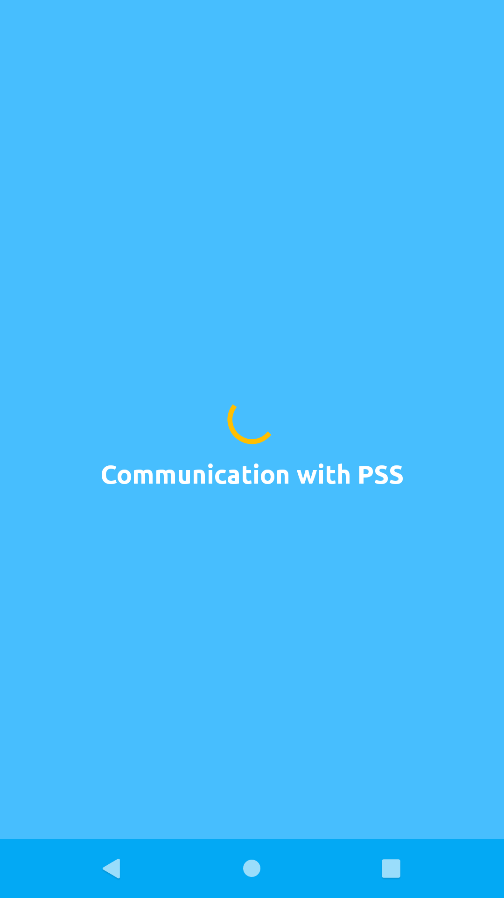

If a secure communication channel was succcessfully established, **Okay** presents the authorization screen.

Click the "OKAY" button to grant authorization.

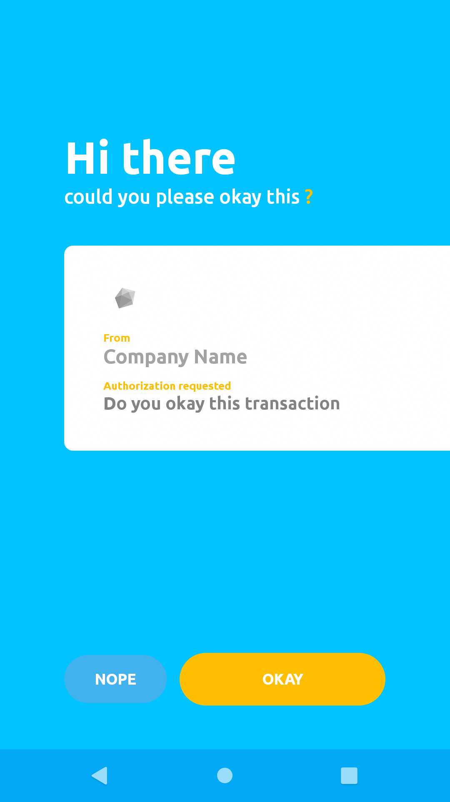

Click "Start Now" on the modal popup to proceed.

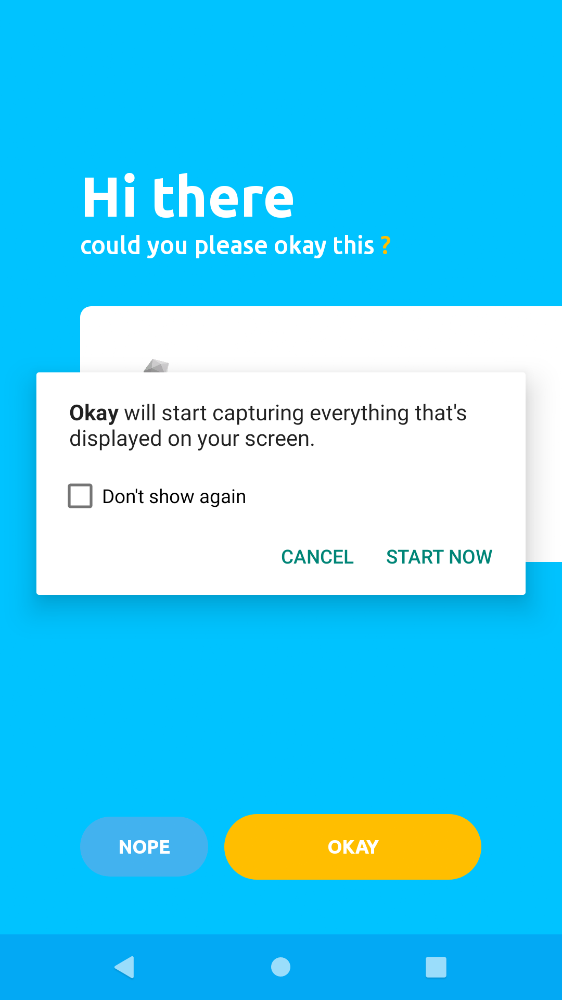

If all goes well, Okay will present a success screen like the one below, to notify you that the request was approved successfully.

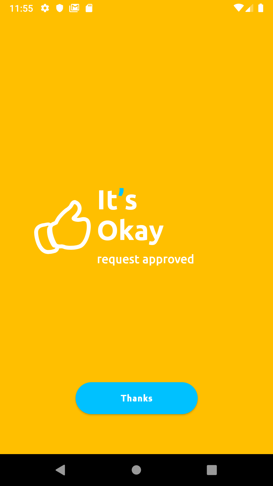


For better reference to all possible status code and messages you can recieve from **Okay** server please refer to this [link](https://github.com/Okaythis/okay-example/wiki/Server-Response-Status-Codes).

The `sessionExternalId` can be used to check the status of this request. We will see shortly, in the **Check Authentication/Authorization Status** section, how we can use the  `sessionExternalId` value retrieved from the response to check the status of our transaction.

**Check Authentication/Authorization Status**
=============================================

After Authorizing/Authenticating a user we can check the status of that request by sending a JSON payload as a **POST** request to this endpoint `https://demostand.okaythis.com/gateway/check` on **Okay** Server.

### ***This is a typical structure of our JSON payload for checking authentication/authorization status***

```JSON
{
  "tenantId": "<your tenant id>",
  "sessionExternalId": "sessionExternalId from previous Auth request",
  "type": "authorization type",
  "authParams": {
    "guiText": "message that is shown in the Okay application",
    "guiHeader": "header of the message that is shown in the Okay application"
  },
  "signature": "request signature"
}
```

Send a request to check the status of your transaction.

```js
  const crypto = require('crypto')
  const axios = require('axios')

  const PSS_BASE_URL = 'https://demostand.okaythis.com';
  const tenantId = 40007; // replace with your tenantId
  const sessionExternalId  = 100227; // "replace with your 'sessionExternalId' from previous Auth request
  const secret = 'securetoken'; // //replace with your secret
  const hashStr = `${tenantId}${sessionExternalId}${secret}`;
  const signature = createHashSignature(hashStr);

  axios({
    method: 'post',
    headers: {
      'Content-Type': 'application/json'
    },
    url: `${PSS_BASE_URL}/gateway/check`,
    data: {
      tenantId,
      sessionExternalId,
      signature
    }
  })
  .then((response) => {
    console.log(response.data);
  })
  .catch((error) => {
    console.log(error.response.data)
  });

  function createHashSignature(hashStr) {
    return crypto
      .createHash('sha256')
      .update(hashStr)
      .digest('base64')
  }
```

When your request is correct you'll get a response with the following body structure:

```JSON
{
  "status": {
    "code": "<status code>",
    "message": "status message"
  },
  "authResult": {
    "dataType": "<result data type code> eg. 101, 102, 103",
    "data": "user response eg. CANCEL, PIN, OK"
  }
}

```

The `authResult` field may contain any of these values from the table below, as a user response from the mobile app.

| DataType |Data|
-------|--------
| 101 |CANCEL |
| 102 |PIN |
| 103 |OK |

 **Callbacks**
 =============

 Some actions might take users some time to accomplish. To prevent long lasting requests and overloading the Okay server with enormous amount of the **Check** requests, Okay server sends callbacks when the long lasting action is completed. The target URI should be configured at the Okay website on the Tenant Settings page.

 **Note:** every callback has a signature value. Check it to make sure the request is received from the Okay server.

## Link User Callback

 When an end user completes linking, Okay server sends the following JSON data to the callback url that was specified on the tenant settings page:

 ```JSON
  {
    "type": 101,
    "userExternalId": "unique user identifier",
    "signature": "callback signature"
  }
 ```

 Check Callback Types page for all available values of type.

## Authentication (Authorization) Callback

 Okay sends this JSON body when a transaction response from Okay mobile application is received.

 ```JSON
  {
    "type": 102,
    "userExternalId": "unique user identifier",
    "sessionExternalId": "unique session identifier",
    "authResult": {
        "dataType": "<result data type code>",
        "data": "user response"
    },
    "signature": "callback signature"
  }

 ```

 The `authResult` key in the response above, has the same structure as the `authResult` returned from **Check Authentication/Authorization Status** request.

## Unlink User Callback

 When an end user removes your service from the list of connected services from Okay, Okay sends to your server via the callback url a JSON response having the structure below:

 ```JSON
  {
    "type": 103,
    "userExternalId": "unique user identifier",
    "signature": "callback signature"
  }
 ```
